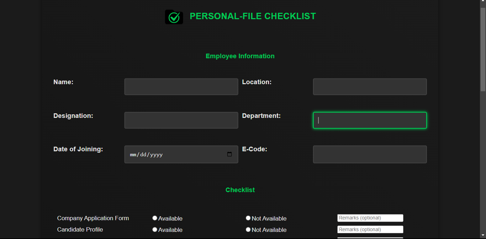
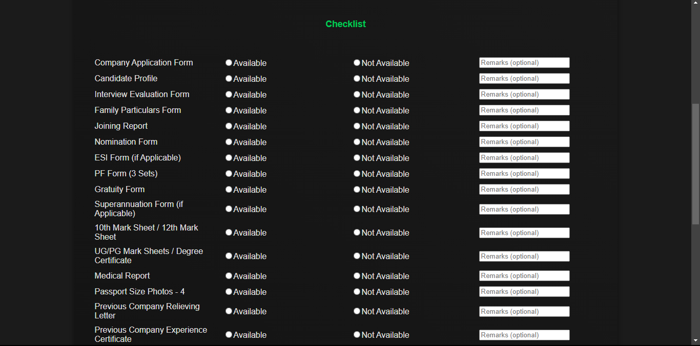
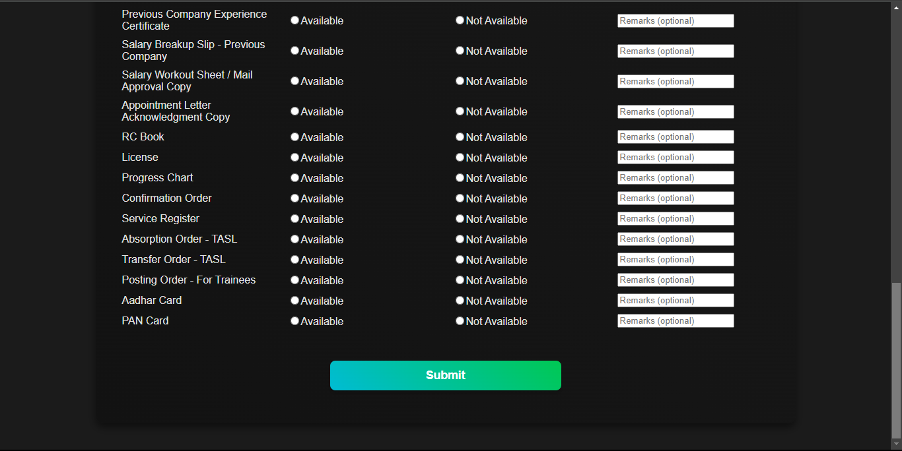
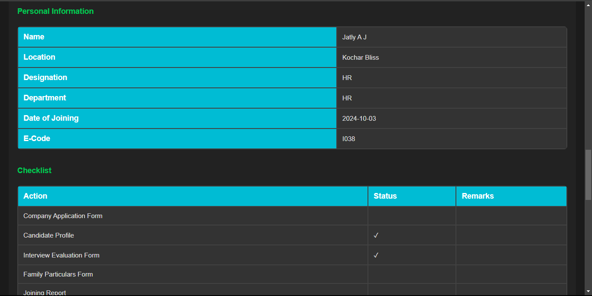
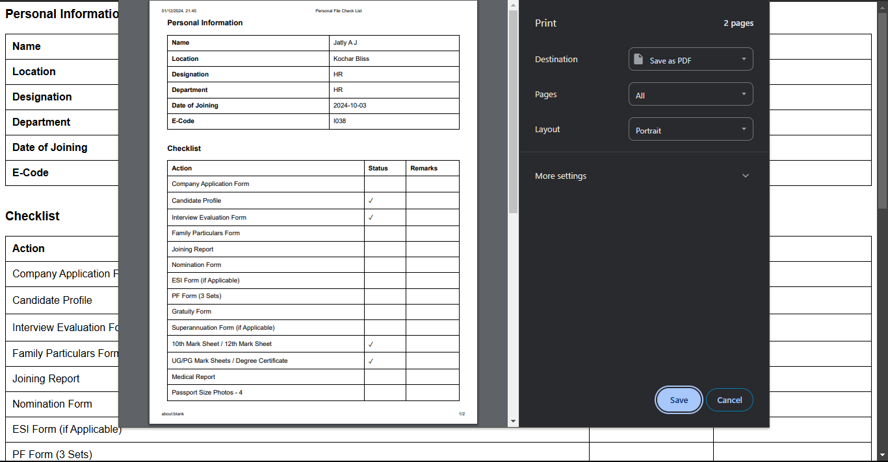
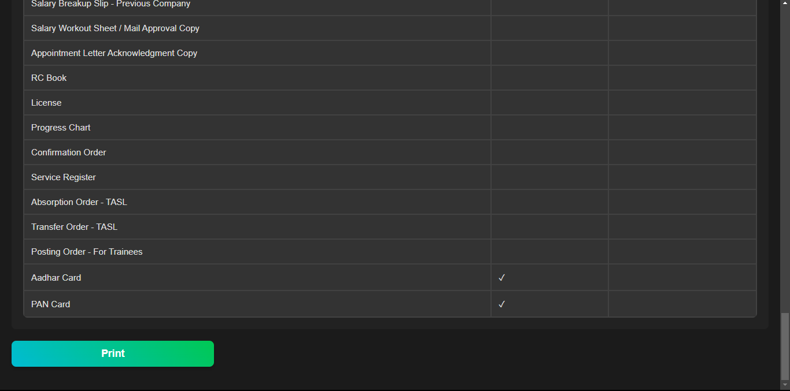

# HR DocuFlow

**HR DocuFlow** is a web-based application designed to streamline HR documentation by generating personalized file checklists for new and existing employees. It simplifies and speeds up the onboarding process, reduces manual errors, and ensures consistent document tracking across the organization.

---

## 🔧 Features

- 🗂️ Generate personal file checklists dynamically for each employee  
- 📄 Download or print employee-specific checklist  
- 📋 Predefined list of required documents (configurable)  
- 🖥️ Web-based UI with clean, user-friendly design  
- 💾 Data storage using SQLite / JSON (configurable)  
- 🧠 Automatically detects missing documents  
- ✅ Checklist items with real-time status tracking  

---

## 💡 Use Case

HR DocuFlow is ideal for HR departments that need a fast and standardized way to prepare and maintain employee personal file records during onboarding, audits, and routine documentation updates.

---

## 📸 Screenshots

### 🧾 Input Form (Dark Mode)


### 📋 Checklist Selection
  
  


### 📤 Generated Checklist Preview


### 🖨️ Print-Friendly View


---

## 🚀 Tech Stack

| Layer      | Technology               |
|------------|--------------------------|
| Frontend   | HTML, CSS, JavaScript    |
| Styling    | Bootstrap / Custom CSS   |
| Backend    | Python (Flask / Django)  |
| Database   | SQLite or JSON File      |
| PDF Export | Print.js / Browser Print |

---

## 🛠️ Installation

```bash
git clone https://github.com/yourusername/hr-docuflow.git
cd hr-docuflow
